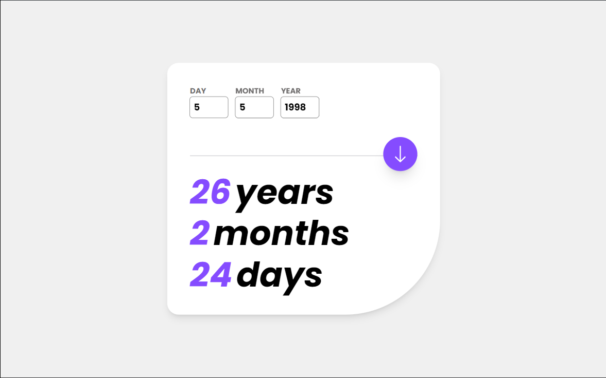
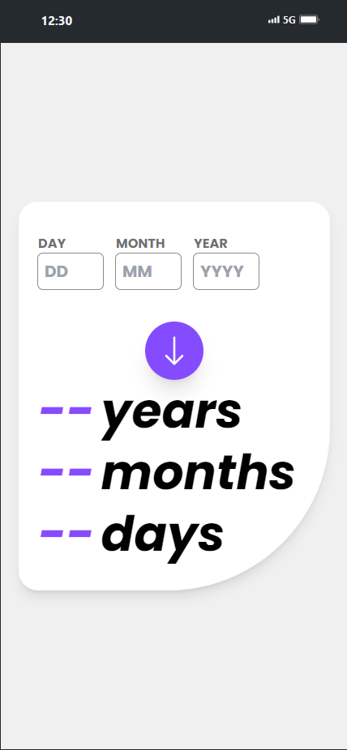

# Calculadora de Idade

Este projeto é uma calculadora de idade interativa, desenvolvida utilizando React, Tailwind CSS e TypeScript. A calculadora permite que os usuários insiram uma data de nascimento e obtenham a idade exata em anos, meses e dias.

## 🚀 Funcionalidades

- **Validação de Data**: Validações em tempo real para assegurar que a data inserida seja válida.
- **Cálculo Preciso**: Cálculo da idade exata em anos, meses e dias.
- **Interface Amigável**: Interface de usuário elegante e intuitiva.

## 📸 Captura de Tela




## 🛠️ Tecnologias Utilizadas

- **React**: Biblioteca JavaScript para construção de interfaces de usuário.
- **Tailwind CSS**: Framework CSS utilitário para estilização rápida e eficiente.
- **TypeScript**: Superset do JavaScript que adiciona tipagem estática ao código.

## ⚙️ Como Executar o Projeto

1. Clone o repositório:
    ```sh
    git clone https://github.com/raphaeleliass/idade-calculadora
    ```
2. Navegue até o diretório do projeto:
    ```sh
    cd idade-calculadora
    ```
3. Instale as dependências:
    ```sh
    npm install
    ```
4. Inicie o servidor de desenvolvimento:
    ```sh
    npm run dev
    ```

## 📝 Uso

1. Insira o dia, mês e ano de nascimento nos campos correspondentes.
2. Clique no botão de calcular (ícone de seta para baixo).
3. A idade exata será exibida abaixo dos campos de entrada.

## 🤝 Contribuições

Contribuições são sempre bem-vindas! Se você tiver sugestões ou melhorias, por favor, abra uma issue ou envie um pull request.

## 📧 Contato

Se você quiser discutir sobre o projeto ou oportunidades de trabalho, sinta-se à vontade para me contatar:
- **LinkedIn**: [Meu Linkedin](https://linkedin.com/in/seuperfil/)
- **Instagram**: [Meu Instagram](https://instagram.com/raphaeleliass)
